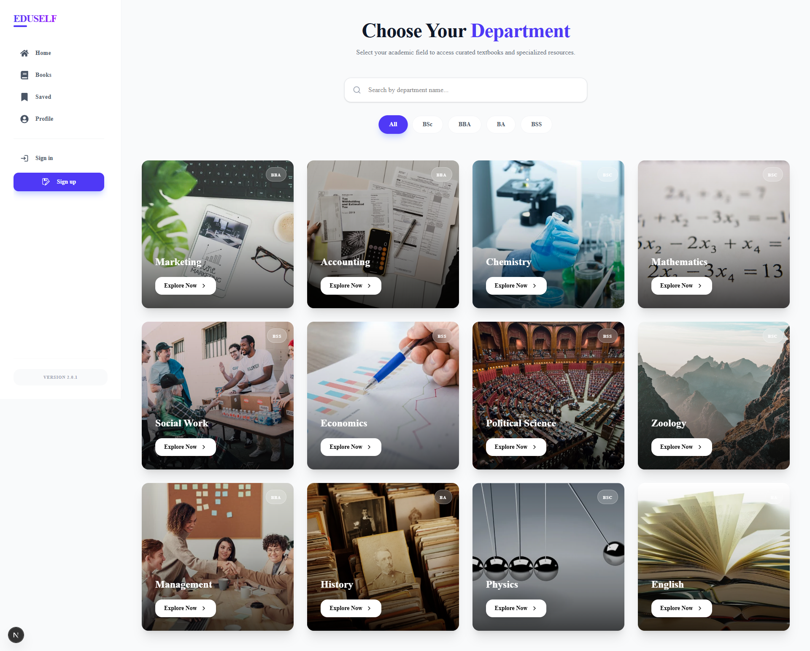

# 🎓 অর্নাস অনলাইন বই পড়ার প্ল্যাটফর্ম

এটি একটি অনলাইন বই পড়ার ওয়েবসাইট, যা বিশেষভাবে **অর্নাস শিক্ষার্থীদের** জন্য তৈরি।  
এই প্ল্যাটফর্মের মাধ্যমে শিক্ষার্থীরা খুব সহজেই তাদের **ডিপার্টমেন্ট** এবং **বর্ষ** অনুযায়ী প্রয়োজনীয় একাডেমিক বই অনলাইনে পড়তে পারবে।

---

## প্রজেক্টের সংক্ষিপ্ত বিবরণ

বর্তমানে অর্নাস শিক্ষার্থীদের জন্য প্রয়োজনীয় বই এক জায়গায় খুঁজে পাওয়া অনেক কঠিন। এই সমস্যার সমাধান হিসেবেই এই ওয়েবসাইটটি তৈরি করা হয়েছে।

শিক্ষার্থী শুধু তার  
- ডিপার্টমেন্ট  
- বর্ষ (১ম, ২য়, ৩য়, ৪র্থ বর্ষ)  

সিলেক্ট করলেই, তার প্রয়োজনীয় সকল বই এক জায়গায় দেখতে ও পড়তে পারবে।

---

## যে সমস্যাগুলো এই প্রজেক্টে সমাধান করা হয়েছে

-  প্রয়োজনীয় অর্নাস বই এক জায়গায় না পাওয়া  
-  ডিপার্টমেন্ট ও বর্ষ অনুযায়ী বই খুঁজে পেতে ঝামেলা  
-  PDF বা বইয়ের লিংক খুঁজতে ফেসবুক/গুগেলের উপর নির্ভরতা  
-  মোবাইলে বই পড়ার সময় খারাপ ইউজার এক্সপেরিয়েন্স  
-  সময় নষ্ট করে আলাদা আলাদা জায়গা থেকে বই সংগ্রহ করা  

---

## ✅ এই প্রজেক্ট ব্যবহার করলে যেসব সুবিধা পাওয়া যাবে

-  নির্দিষ্ট ডিপার্টমেন্ট ও বর্ষ অনুযায়ী বই পাওয়া  
-  সময় বাঁচবে, কারণ সব বই এক প্ল্যাটফর্মে থাকবে  
-  মোবাইল থেকে খুব সহজে বই পড়া যাবে  
-  যেকোনো সময়, যেকোনো জায়গা থেকে বই পড়ার সুবিধা  
-  পড়াশোনার প্রতি আগ্রহ বাড়বে  
-  বই কেনার খরচ কমবে  

---

## 🌟 প্রধান ফিচারসমূহ

-  ডিপার্টমেন্ট অনুযায়ী বই ক্যাটাগরি  
-  বর্ষভিত্তিক বই ফিল্টার সিস্টেম  
-  সহজ সার্চ ও ফিল্টার অপশন  
-  সম্পূর্ণ মোবাইল রেসপন্সিভ ডিজাইন  
-  পরিষ্কার ও ইউজার-ফ্রেন্ডলি ইন্টারফেস  
-  দ্রুত লোডিং ও স্মুথ ন্যাভিগেশন  

---

## টার্গেট ইউজার

- অর্নাস শিক্ষার্থীরা  
- কলেজ ও বিশ্ববিদ্যালয়ের শিক্ষার্থী  
- যারা অনলাইনে একাডেমিক বই পড়তে চায়  

---

## ব্যবহৃত টেকনোলজি

🎨 Frontend Technology

⚙️ Backend

🗄️ Database

🔐 Authentication

  
Role-Based Access Control

---

